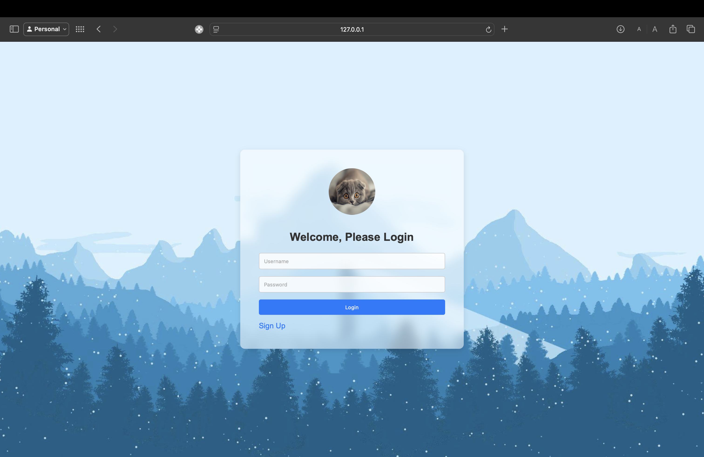

# MongoDB Flask Application

This project uses MongoDB as the database along with Flask as the web framework. Below are the instructions for setting up MongoDB and starting the server on macOS.

---





---

## Installation Instructions

### 1. Install MongoDB on macOS

If you don't have MongoDB installed, follow these steps to install it via Homebrew:

````bash
brew tap mongodb/brew
brew install mongodb-community@6.0

### 2. Start MongoDB Server

Start MongoDB as a background service using Homebrew:

```bash
brew services start mongodb/brew/mongodb-community@6.0
brew services start mongodb/brew/mongodb-community
````

You can check the status of the service using:

```bash
brew services list
```

To stop MongoDB, use:

```bash
brew services stop mongodb/brew/mongodb-community@6.0
```

### 3. Install Python Dependencies

Create and activate a virtual environment for the project:

```bash
python3 -m venv .venv
source .venv/bin/activate
```

Next, install the required Python packages:

```bash
pip install -r requirements.txt
```

### 4. Running the Flask Application

Once MongoDB is running, start the Flask application:

```bash
python app.py
```

By default, the application will run on `http://127.0.0.1:5000`.

If you want to run the app on a different port, you can specify it as follows:

```bash
python app.py --port=5001
```

---

## Troubleshooting

### Port Already in Use

If you encounter an error about port 5000 being in use, stop the process using the port:

```bash
lsof -i :5000
kill -9 <PID>
```

You can also specify a different port when running the Flask application:

```bash
python app.py --port=5001
```

---

## MongoDB Connection Issues

Ensure MongoDB is running by checking its status:

```bash
brew services list
```

If MongoDB is not running, start it using:

```bash
brew services start mongodb/brew/mongodb-community@6.0
```
